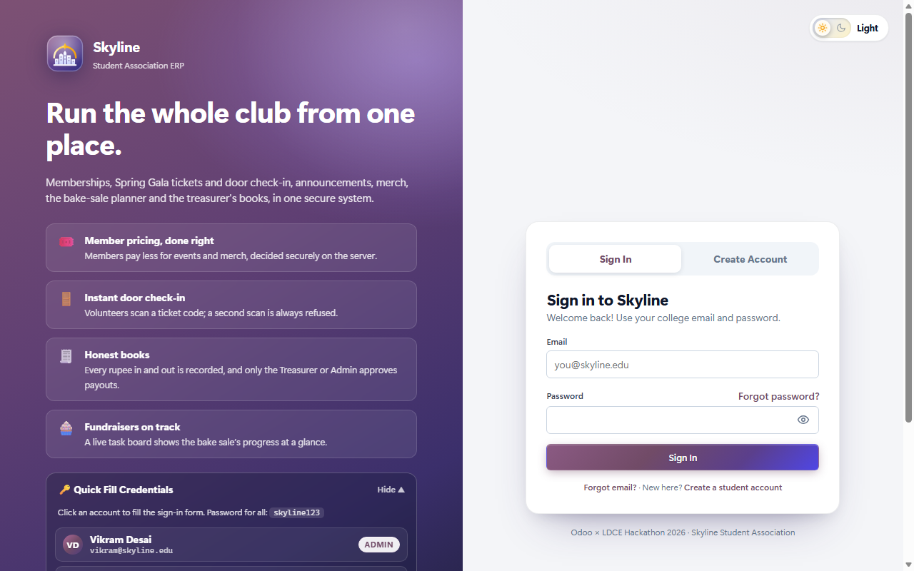
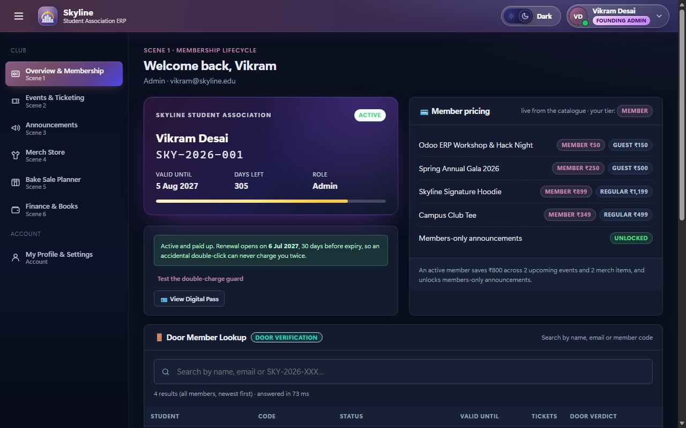
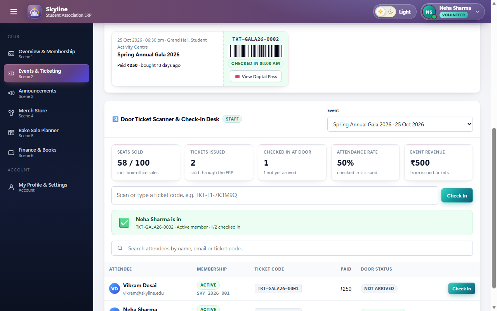
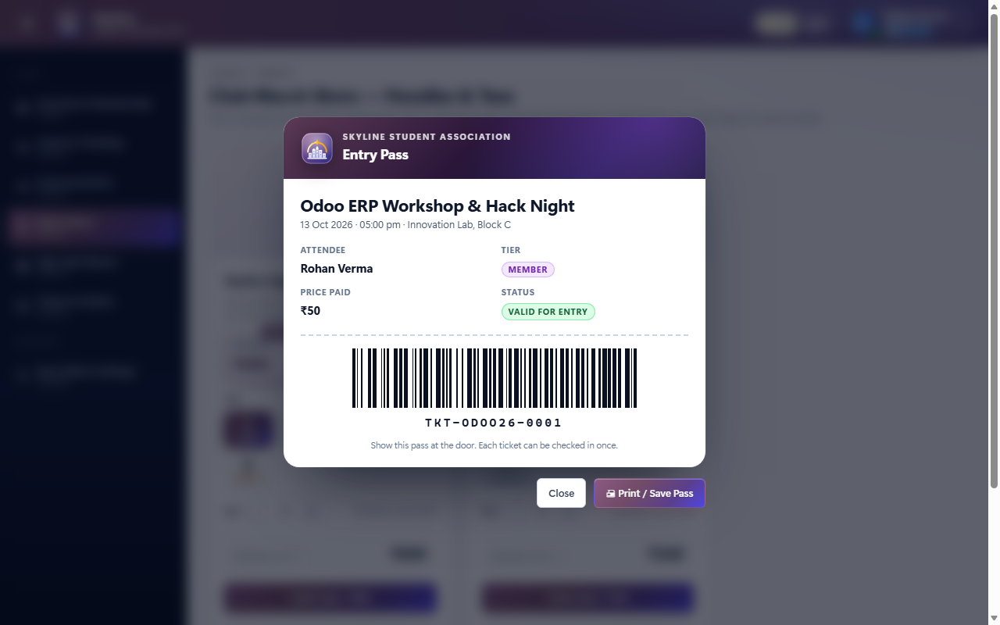
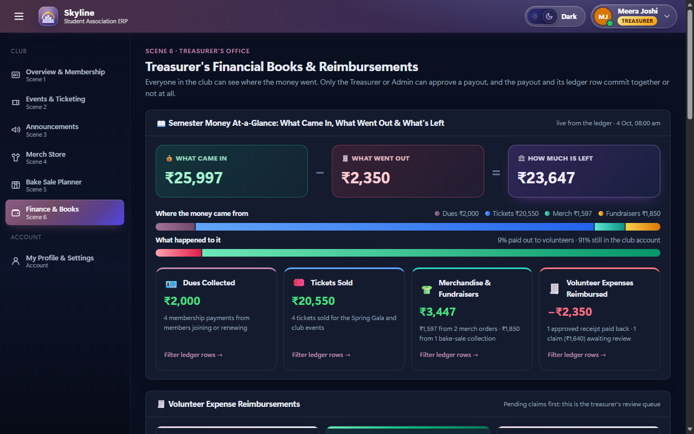

# Skyline Student Association ERP

A small, complete ERP for a student association, built for the **Odoo × LDCE Hackathon 2026**. It covers memberships, event ticketing with door check-in, announcements, a merch store, a fundraiser task board, and the treasurer's books, all on one transactional SQLite database with a zero-dependency browser UI. Four roles (Admin, Treasurer, Volunteer, Student) each see exactly what they're allowed to do, and admins manage those roles from inside the app under a Founding Admin hierarchy. Tickets, member IDs and reimbursement vouchers come as printable digital passes with scannable barcodes, and the open books hide other members' names from students.

- **Backend:** Node.js 22.5+ · Express 5 · SQLite (`better-sqlite3`, with an automatic fallback to Node's built-in `node:sqlite`)
- **Frontend:** plain HTML, CSS and JavaScript in `public/`. No build step, no CDN, no web fonts, so it works with no internet connection. Full-screen sign-in with account recovery, a profile page, a collapsible sidebar that becomes a drawer on phones, light/dark themes, and a custom inline-SVG Skyline emblem.
- **Proof:** 8 automated verification suites (255 checks) run against real server processes on both SQLite drivers, plus two live terminal demos for concurrency and index performance.

---

## Visual tour

Captured from the running app at 1280×800 (light and dark themes) using the seeded demo data.

| | |
|---|---|
| **Sign-in portal** (light): full-screen sign-in with Quick Fill demo accounts, forgot-email / forgot-password, and the Light/Dark pill | **Overview & Membership** (dark): the Founding Admin's member card, live member pricing and Door Member Lookup |
|  |  |
| **Events & door check-in** (light): a volunteer scans a ticket; attendance stats, the attendee search and a ticket stub with its real barcode | **Digital Entry Pass** (light): a student's printable pass with tier, check-in status and a scannable Code 128 barcode, opened over the Merch Store |
|  |  |
| **Treasurer's books** (dark): What Came In − What Went Out = How Much Is Left, where the money came from, and the four breakdown cards that filter the ledger | |
|  | |

---

## What's new in the final sprint

| Area | What it does | API |
|---|---|---|
| **Event editing** | The Admin edits title, date, venue, prices and capacity inline on each event card. Seats already sold stay sold: `seats_left` moves with `total_seats`, and capacity can't drop below seats sold. | `PATCH /api/events/:id` |
| **Admins don't buy** | The Admin sees an **Admin Report & Analytics View** on events and products instead of Buy/Order buttons, and the server refuses admin purchases (`403`). The Admin's card shows **LIFETIME ADMIN ACCESS · NO EXPIRY**, with no countdown or renewal. | `POST …/tickets`, `POST /api/merch/orders` |
| **Club hierarchy** | Admin › Treasurer › **Student · Club Member** › Volunteer › **Student (Non-Member)**. A student's label comes from their live membership and is shown on pills, badges and tables. | |
| **Bake-sale permissions** | Only the Admin and Treasurer create, edit, assign or delete tasks. Only the assigned person (or the Admin) moves a task. | `POST/PATCH/DELETE /api/tasks…` |
| **Task requests** | Club members and volunteers press **✋ Request to Take This Task** with a note. The Admin's **Pending Task Requests** queue has **Approve & Assign**, which assigns the task and rejects the other pending requests for it, in one transaction. | `POST /api/tasks/:id/request`, `PATCH /api/tasks/requests/:id/review` |
| **Scoped access** | The Founding Admin gives each person a role **and** an access scope: Full Club, Events, Merch, Bake Sale or Finance only. Outside it the server answers `403 "Your admin access is scoped strictly to: …"`. | `PATCH /api/users/:id/role` (`access_scope`), `requireScope()` |
| **5-category merch** | Hoodies, T-Shirts, Caps, Pants / Joggers and Accessories, each with cost price, low-stock threshold, inventory manager and a 4-angle gallery (front, back, side, close-up). Hover zooms inside the photo; a click opens a lightbox with 1× / 2× / 3× zoom, drag-to-pan, wheel zoom and arrow keys. | `POST/PATCH /api/merch/items` |
| **Low-stock alerts** | Any size at or below its threshold appears in a **⚠️ Low Inventory Alert** on the Admin's and the item manager's dashboard, with **+ Restock Now**. A manager can restock their own items. | `GET /api/merch/items` (`low_stock`) |
| **Profit & loss** | Units sold, revenue, purchase cost (cost price × units), net profit and margin per product, ranked by units sold, for the last 7, 30 or 90 days or all time. Shown on the Merch and Finance pages for the Admin and Treasurer. | `GET /api/merch/analytics?period=7d\|30d\|90d\|all` |
| **Confirmation dialogs** | Sign Out, Save Name, Update Password, Update Access and Delete Task each ask "are you sure?" first. | |
| **105-user dataset** | `npm run seed -- --reset` loads the 5 named accounts (IDs 1–5) plus 100 more students, along with dues, tickets, merch orders across 7, 30 and 90 days, and 3 pending task requests. The access table has search and pages. The test suites use a compact 5-user profile (`SEED_PROFILE=compact`) so their exact counts stay stable; `verify-phase8.js` checks the full profile. | |

## The six scenes and how they connect

| # | Scene | What happens | Writes to |
|---|---|---|---|
| 1 | **Membership** | Join or renew for ₹500/year. Renewal opens 30 days before expiry, so a double click can't charge twice. Door staff look members up by name, email or `SKY-2026-NNN` code. Every member gets a printable **Member ID Pass** with a barcode of their code. | `users`, `ledger_transactions` |
| 2 | **Events & door check-in** | Members pay the member price and everyone else the guest price, decided **on the server** from the live membership. Seats are claimed in a locked transaction. Volunteers scan `TKT-…` codes at the door; a second scan is refused. Each ticket opens as a printable **Entry Pass** (tier, price paid, check-in status, barcode). | `events`, `tickets`, `ledger_transactions` |
| 3 | **Announcements** | Category and keyword archive. Members-only posts are filtered out in SQL for non-members, who see how many are hidden. Staff broadcasts report a recipient count. | `announcements` |
| 4 | **Merch store** | Hoodies and tees with per-size stock (S/M/L/XL), member vs regular pricing, and a pickup desk that records who handed each order over and when. The Admin restocks any size, including sold-out ones, from the product card. | `merch_variants`, `merch_orders`, `ledger_transactions` |
| 5 | **Bake-sale planner** | A To do / In progress / Done board with campaign progress and an "on track" flag (no overdue unfinished tasks). Cards move in every direction (start, back to To do, done, reopen). Staff assign people from a dropdown on each card, and an unassigned task can't be started or finished. Students may move only tasks assigned to them; only the Admin can delete a task. | `fundraiser_tasks` |
| 6 | **Treasurer's books** | A **Semester Money At-a-Glance** panel answers the treasurer's questions for everyone in the club: *What Came In − What Went Out = How Much Is Left*, then dues collected, tickets sold, merchandise and fundraisers, and volunteer expenses reimbursed (with claims still waiting). Each card filters the ledger to the rows behind it. Staff submit receipts; only the Treasurer or Admin can approve, never on their own claim, and approval writes exactly one money-out row. The Treasurer and Admin also export the books as CSV and record fundraiser income. Every approved claim has a printable **Treasurer Payment Voucher**. Students see every amount, but other members' names and codes are masked on the server. | `expense_reimbursements`, `ledger_transactions` |

**The thread that ties them together is the ledger.** Every rupee that moves (dues, ticket sales, merch sales, fundraiser income, reimbursements) is appended to `ledger_transactions` *in the same transaction* as the change that caused it. The treasurer's totals therefore always reconcile: `total_in − total_out = net_balance`, and the five categories add up to the whole.

---

## Architecture

```
Browser (public/app.js)            Express 5 (server.js)                         SQLite (skyline.db)
 one state object  ── fetch + ──▶   requireAuth / optionalAuth / requireRole  ──▶ WAL · foreign_keys=ON
 re-fetch after      Bearer         routes/*.js  (validate → withTransaction)     10 tables, 3NF
 every write         token          lib/*.js     (pricing, codes, ledger)         BEGIN IMMEDIATE writes
 friendly toasts    ◀── JSON ────    HttpError → JSON status codes
```

| Concern | How it's done | Where |
|---|---|---|
| Database safety | `PRAGMA foreign_keys = ON`, `journal_mode = WAL` and `busy_timeout` on every connection; startup fails loudly if foreign keys aren't on. | `db.js` `connect()` |
| Schema | `CREATE TABLE IF NOT EXISTS` for 10 tables, `CHECK` constraints (`seats_left >= 0`, `stock_count >= 0`, enum columns), plus startup migrations: newer columns are added to older databases, and the `users` table is rebuilt in place (foreign keys checked) to accept the `TREASURER` role. | `db.js` `SCHEMA`, `applySchema()`, `upgradeUserRoles()` |
| Atomic writes | `withTransaction(fn)`: `BEGIN IMMEDIATE … COMMIT`, `ROLLBACK` on any error, savepoints for nesting, `SQLITE_BUSY` retry with backoff. | `db.js` |
| Passwords | `scrypt` with a random 16-byte salt (`saltHex:hashHex`), compared with `crypto.timingSafeEqual`. Unknown emails are checked against a dummy hash, so response time doesn't reveal which accounts exist. | `lib/password.js` |
| Sessions | Stateless tokens: `base64url(JSON payload).HMAC-SHA256`, 7-day expiry. The signature is verified **before** the payload is trusted. | `lib/token.js`, `middleware/requireAuth.js` |
| Authorization | `requireAuth` (401), `requireRole(...)` (403), plus row-level rules in routes: students move only their own tasks, and nobody (Treasurer or Admin) can review their own claim. The token proves *who* you are; your role is read live from the `users` row on every request, so a promotion or demotion applies on the very next click. | `middleware/`, `routes/` |
| Account recovery | Forgot email: look an account up by membership code or full name; the email comes back for that account only. Forgot password: email **plus** membership code or full name, a new password of 6+ characters, and an immediate sign-in. A wrong pair and an unknown email get the same `401`. | `server.js` `/api/auth/*` |
| Pricing | Always recalculated on the server from the live membership row. Prices in request bodies are ignored. | `routes/events.js`, `routes/merch.js` |
| Input handling | Strict parsers for ids, enums and integers (`400` before any DB work); parameterised SQL everywhere; `LIKE` wildcards escaped; 100 kb JSON limit (`413`). | `lib/http.js` |
| Ledger privacy | Students get the full totals, but on other people's rows the server swaps the name for "Club Member" ("Volunteer" on reimbursements), masks ticket, order and membership codes to their prefix (`TKT-GALA26-•••`), and strips the name from the description. Those codes are credentials: they admit someone at the door, collect an order at the desk, or help reset a password. Staff see everything. | `routes/finance.js` `maskTransaction()` |
| Barcodes | A Code 128 (set B) generator in plain JavaScript draws each code as an SVG barcode with a mod-103 check symbol and quiet zones. It needs no library and no network. | `public/app.js` `code128Widths()`, `barcodeSvg()` |
| Static files | Only `public/` is web-reachable. Server code, the database and dotfiles return 404. | `server.js` |

---

## Data model: 10 tables in third normal form

Each fact is stored once. Prices live on `merch_items` while stock lives per size on `merch_variants`; orders point at the exact variant; names are joined in, never copied.

```mermaid
erDiagram
    users ||--o{ tickets : "buys"
    users ||--o{ announcements : "authors"
    users ||--o{ merch_orders : "places"
    users |o--o{ merch_orders : "hands over (picked_up_by)"
    users |o--o{ fundraiser_tasks : "assigned to"
    users ||--o{ expense_reimbursements : "submits (volunteer_id)"
    users |o--o{ expense_reimbursements : "reviews (approved_by)"
    users |o--o{ ledger_transactions : "pays / is paid"
    events ||--o{ tickets : "has"
    merch_items ||--|{ merch_variants : "comes in sizes"
    merch_variants ||--o{ merch_orders : "sold as"

    users {
        INTEGER id PK
        TEXT name
        TEXT email UK
        TEXT password_hash
        TEXT role "STUDENT | VOLUNTEER | TREASURER | ADMIN"
        TEXT membership_code UK "SKY-2026-NNN"
        TEXT membership_status "NONE | ACTIVE | EXPIRED"
        TEXT membership_expires_at
        TEXT created_at
    }
    events {
        INTEGER id PK
        TEXT title
        TEXT description
        TEXT event_date
        TEXT location
        INTEGER total_seats "CHECK > 0"
        INTEGER seats_left "CHECK >= 0"
        INTEGER member_price
        INTEGER guest_price
        TEXT created_at
    }
    tickets {
        INTEGER id PK
        TEXT ticket_code UK
        INTEGER event_id FK
        INTEGER user_id FK
        INTEGER price_paid
        INTEGER checked_in "0 | 1"
        TEXT checked_in_at
        TEXT created_at
    }
    announcements {
        INTEGER id PK
        TEXT title
        TEXT content
        TEXT category "MEETING | DEADLINE | EVENT | GENERAL"
        TEXT target_audience "ALL | MEMBERS_ONLY"
        INTEGER author_id FK
        TEXT created_at
    }
    merch_items {
        INTEGER id PK
        TEXT name
        TEXT description
        TEXT category
        INTEGER member_price
        INTEGER regular_price
        TEXT created_at
    }
    merch_variants {
        INTEGER id PK
        INTEGER item_id FK "UNIQUE with size"
        TEXT size "S | M | L | XL"
        INTEGER stock_count "CHECK >= 0"
    }
    merch_orders {
        INTEGER id PK
        TEXT order_code UK
        INTEGER user_id FK
        INTEGER variant_id FK
        INTEGER quantity "CHECK > 0"
        INTEGER total_paid
        TEXT fulfillment_status "PAID_PENDING_PICKUP | PICKED_UP"
        TEXT created_at
        TEXT picked_up_at
        INTEGER picked_up_by FK
    }
    fundraiser_tasks {
        INTEGER id PK
        TEXT campaign_name
        TEXT title
        INTEGER assigned_to FK "nullable"
        TEXT status "TODO | IN_PROGRESS | DONE"
        TEXT due_date
        TEXT created_at
    }
    expense_reimbursements {
        INTEGER id PK
        INTEGER volunteer_id FK
        TEXT title
        TEXT category
        INTEGER amount "CHECK > 0"
        TEXT receipt_reference
        TEXT status "PENDING | APPROVED_PAID | REJECTED"
        INTEGER approved_by FK "nullable"
        TEXT created_at
    }
    ledger_transactions {
        INTEGER id PK
        TEXT type "IN | OUT"
        TEXT category "MEMBERSHIP_DUES | TICKET_SALE | MERCH_SALE | FUNDRAISER_INCOME | EXPENSE_REIMBURSEMENT"
        INTEGER amount "CHECK > 0"
        TEXT description
        TEXT reference_id
        INTEGER user_id FK "nullable"
        TEXT created_at
    }
```



**Indexes.** `UNIQUE` columns (`users.email`, `users.membership_code`, `tickets.ticket_code`, `merch_orders.order_code`, `merch_variants(item_id, size)`) get B-tree indexes automatically. Three more are added on purpose:

| Index | Serves |
|---|---|
| `idx_tickets_event_user (event_id, user_id)` | Duplicate-ticket check on purchase; door roster and attendance stats |
| `idx_tasks_campaign_status (campaign_name, status)` | A campaign's board, grouped by status |
| `idx_ledger_type_category (type, category, created_at)` | Treasurer totals and filters by type, category and date |

`GET /api/system/proof` (staff token required; checked by `verify-phase6.js`) returns the live `EXPLAIN QUERY PLAN` for each lookup: every one is a `SEARCH … USING INDEX`, none a `SCAN`.

---

## Concurrency and race-condition defense

Every check-then-write (is there a seat left? is this size in stock? is this claim still pending?) runs inside `withTransaction`:

```js
withTransaction(() => {
  const event = db.prepare('SELECT * FROM events WHERE id = ?').get(id);
  if (event.seats_left <= 0) throw new HttpError(409, 'Event is sold out');
  db.prepare('UPDATE events SET seats_left = seats_left - 1 WHERE id = ? AND seats_left > 0').run(id);
  // …insert the ticket and its ledger row…
});
```

1. **`BEGIN IMMEDIATE`** takes SQLite's single write lock *before* the first read. A second buyer, even in another server process, waits at `BEGIN` and then reads the already-committed result, so the check can't go stale before the write (no time-of-check-to-time-of-use gap).
2. **Guarded updates** (`… AND seats_left > 0`, `… AND stock_count >= ?`, `… AND status = 'PENDING'`) refuse to act on a state that has already changed.
3. **`CHECK` constraints** (`seats_left >= 0`, `stock_count >= 0`) are the last line: the database itself rejects a negative value.
4. **`SQLITE_BUSY` handling:** a 1-second `busy_timeout`, then up to 5 retries with exponential backoff and jitter. The whole transaction is rolled back and re-run, so callbacks are synchronous and touch only the database.
5. **All-or-nothing:** the sale, the stock or seat change, and the ledger row commit together, or nothing does.

The UI adds a second layer: while a request is in flight every action button is disabled and shows "Processing…", and after each write the page re-fetches from the server instead of guessing.

**See it live:** `npm run proof:concurrency` starts 5 independent server processes against one temporary database and runs three races. Each produces exactly one winner and four `409`s:

| Race | Outcome |
|---|---|
| Last Spring Gala seat (5 buyers) | 1 × `201 Created`, 4 × `409 Event is sold out`, `seats_left = 0` |
| Last size XL hoodie (5 orders) | 1 × `201 Created`, 4 × `409 Size XL is out of stock`, `stock_count = 0` |
| One ₹650 receipt (5 treasurer approvals) | 1 × `200 OK`, 4 × `409 Reimbursement already APPROVED_PAID`, one −₹650 ledger row |

---

## Quick start

```bash
npm install
npm run seed -- --reset     # fresh demo data (the server also seeds an empty database on first start)
npm start                   # http://localhost:3000
```

### Roles and demo accounts

All five passwords are `skyline123`. On the sign-in page, open **🔑 Quick Fill Credentials** and click an account: it fills the email and password, and you press **Sign In** yourself.

| Account | Email | Role | Shows off |
|---|---|---|---|
| Vikram Desai | `vikram@skyline.edu` | Founding Admin (`SKY-2026-001`) | Creates events, deletes tasks, grants and changes every role (including Admin), approves claims (including the Treasurer's) |
| Meera Joshi | `meera@skyline.edu` | Treasurer (`SKY-2026-002`) | Approves or rejects reimbursements, records fundraiser income, exports the books as CSV |
| Neha Sharma | `neha@skyline.edu` | Volunteer (`SKY-2026-003`) | Door check-in, pickup desk, announcements, task board, submits expense receipts |
| Rohan Verma | `rohan@skyline.edu` | Student, member expiring in 10 days (`SKY-2026-004`) | Member prices (₹250 Gala, ₹899 hoodie), members-only posts, renewal banner |
| Kabir Singh | `kabir@skyline.edu` | Student, not a member | Guest prices (₹500 Gala, ₹1,199 hoodie), hidden members-only posts, refused staff actions |

**Who can do what.** "Staff" means Volunteer, Treasurer and Admin. Every rule is enforced on the server with `requireRole`; the UI only hides what the server would refuse anyway.

| Action | Student | Volunteer | Treasurer | Admin |
|---|:-:|:-:|:-:|:-:|
| Join/renew, buy tickets and merch, read announcements | ✓ | ✓ | ✓ | ✓ |
| See the semester books: at-a-glance panel and ledger (students: others' names masked) | ✓ | ✓ | ✓ | ✓ |
| Move a bake-sale task | own tasks only | ✓ | ✓ | ✓ |
| Door lookup and check-in, pickup desk, post announcements, add and assign tasks | | ✓ | ✓ | ✓ |
| Submit an expense receipt, `GET /api/system/proof` | | ✓ | ✓ | ✓ |
| Approve or reject a reimbursement (never your own) | | | ✓ | ✓ |
| Record fundraiser income, export the ledger as CSV | | | ✓ | ✓ |
| Create an event, delete a task, restock a merch size, manage roles | | | | ✓ |

### Club access and the Founding Admin

Admins manage roles from the **🛡️ Club Access & Role Management** table on the Overview tab (`GET /api/users`, `PATCH /api/users/:id/role`).

- **The Founding Admin** (the first account, Vikram) is at the top. Nobody can change this account's role, and only this account can grant Admin or change another Admin.
- **A second Admin** can move members between Student, Volunteer and Treasurer. Trying to grant or change Admin is refused with *"Only the Founding Admin can grant or modify Admin access. You may assign Student, Volunteer, or Treasurer roles."* The table shows the Admin option as disabled with that note.
- **Nobody can change their own role**, not even the Founding Admin.
- Because roles are read live, a promoted volunteer gets staff access, and a demoted one loses it, on their next request without signing out.

### Bake-sale workflow

- **Every direction:** To do → **Start Task →**; In progress → **← Move to To Do** or **Mark Done ✓**; Done → **← Move to In Progress** or **↺ Reopen to To Do**.
- **Unassigned guard:** `PATCH /api/tasks/:id/status` refuses to start or finish a task with nobody assigned (`409`, *"Please assign a volunteer or member to this task before starting or completing it"*). Unassigning a task that is in progress is refused the same way.
- **Inline assign:** staff pick or change the assignee from a dropdown on each card. The same endpoint takes `{ assigned_to }`, `{ status }`, or both.
- **Admin delete:** `DELETE /api/tasks/:id` (Admin only) removes a task and returns the updated `campaigns_summary`.

### Semester money at a glance

`GET /api/finance/ledger` is open to every signed-in member and returns a `semester_story`:

| Field | What it holds |
|---|---|
| `came_in`, `went_out`, `left` | Total in, total out and the balance (`came_in − went_out = left`) |
| `dues_collected` | ₹ and count of `MEMBERSHIP_DUES` rows |
| `tickets_sold` | ₹ and count of `TICKET_SALE` rows |
| `merch_sold` | ₹ and count of `MERCH_SALE` rows |
| `fundraiser_income` | ₹ and count of `FUNDRAISER_INCOME` rows |
| `expenses_reimbursed` | ₹ and count of approved `EXPENSE_REIMBURSEMENT` rows, plus `pending_count` / `pending_amount` of claims still awaiting review |

`?category=` also takes a comma-separated list, so the "Merchandise & Fundraisers" card filters with `?category=MERCH_SALE,FUNDRAISER_INCOME`.

**Privacy for students.** The totals, `by_category` and `semester_story` are the same for everyone. In `transactions`, a student sees their own rows in full. Every other row tied to a person comes back with `user_name: "Club Member"` (or `"Volunteer"` on a reimbursement), `user_id: null`, a masked code such as `SKY-2026-•••`, the name removed from the description, and `masked: true`. A `privacy` block reports how many rows were masked. Rows with no person attached, such as box-office takings and bake-sale collections, are shown as they are. Volunteers, the Treasurer and the Admin see every name.

### Digital passes and printing

| Pass | Where | Shows | Barcode |
|---|---|---|---|
| **Entry Pass** | Events → My Tickets → *View Digital Pass* | Event, date, venue, attendee, MEMBER/GUEST tier, price paid, *VALID FOR ENTRY* or *CHECKED IN AT …* | `TKT-…` |
| **Official Member ID Pass** | Overview or Profile → *View Digital Pass* | Name, member ID, role, valid-until date, status | `SKY-2026-NNN` |
| **Official Treasurer Payment Voucher** | Finance → an approved claim → *View Voucher* | Amount, receipt reference, volunteer, expense, category, approver, paid-on time, ledger row, signature lines | `RCP…` receipt reference |

**Print / Save Pass** calls `window.print()`. While a pass is open, the `@media print` stylesheet hides everything except that pass, keeps its colours, and hides the buttons, so the printout or PDF is just the pass. Passes are light documents in both themes. Esc or a click outside closes one.

### Admin restock

`PATCH /api/merch/variants/:id/restock` (Admin only) takes `{ "add_quantity": 1–500 }` and adds it with `stock_count = stock_count + ?` inside the write lock, so a restock can't overwrite a sale that commits at the same moment. Bad quantities get `400`, an unknown size `404`, and anyone but the Admin `403`. On each product card the Admin gets a size menu (defaulting to the emptiest size), a quantity box and **+ Restock XL (+10)**.

### Sign-in, recovery and profile

- **Sign in / Create account:** a full-screen split page with a show/hide password toggle. Registration asks for the password twice (8+ characters) and signs you in straight away.
- **Forgot email** (`POST /api/auth/forgot-email`): enter your membership code (`SKY-2026-004`) or full name. The account's email appears, and one click puts it in the sign-in form.
- **Forgot password** (`POST /api/auth/forgot-password`): enter your email plus your membership code or full name, then choose a new password (6+ characters). You're signed in with it immediately.
- **My Profile & Settings** (`PATCH /api/auth/profile`): your membership ID card, edit your display name, change your password (the current one is required), pick a light or dark theme, and sign out. Click your profile pill in the top bar to get there. It shows your avatar, a live status dot and a colour-coded role pill.
- **Theme:** the Light/Dark pill in the top bar (a sliding knob over a glowing sun and moon) switches themes. The choice is saved on the device (`localStorage` key `skyline.theme`) and applied before the first paint; with no saved choice, the operating system's preference wins.
- **Layout:** the ☰ button collapses the sidebar to icons on desktop. Below 900 px it opens a slide-out drawer with a backdrop; Esc or a tap outside closes it.
- **Messages:** every result appears as a toast with a plain-language title and sentence (for example "Sold Out" or "Action Not Allowed"), never a raw status code.

### Verification and live proofs

```bash
npm run verify:fast          # all 8 suites on better-sqlite3 (255 checks, ~25 s)
npm run verify               # the same suites on both SQLite drivers
npm run proof:concurrency    # 3 multi-process races with per-process timings
npm run proof:indexes        # B-tree SEARCH vs full SCAN on 25,000 synthetic rows
```

| Suite | Covers |
|---|---|
| `verify-phase1.js` | Pragmas, foreign keys, rollback, busy retry, the 5 seeded accounts across 4 roles, login, register, tampered tokens, index plans |
| `verify-phase2.js` | Membership renewal, member/guest pricing, duplicate tickets, seat race, door check-in |
| `verify-phase3.js` | Double-renewal guard, members-only announcements, merch pricing, stock race, pickup |
| `verify-phase4.js` | Schema migration, task board, reimbursements, Treasurer approvals and the no-self-approval rule, double-payout race, ledger integrity |
| `verify-phase5.js` | Static client, offline guarantee, no file leaks, per-viewer pricing fields |
| `verify-phase6.js` | CSV export (Treasurer/Admin only) and formula-injection guard, live index proof, role separation, account recovery and profile, the semester-at-a-glance numbers, task moves in every direction with the unassigned guard and admin delete, the Founding Admin role hierarchy with live role changes, the TREASURER role migration, and a security and edge-case sweep |
| `verify-phase8.js` | Event editing, admin no-buy, task permissions and the request/approve workflow, scoped admin access, products, low stock, P&L maths, and the full 105-user seed |
| `verify-phase7.js` | Student ledger privacy (own rows full; others masked, even after a rename; staff unmasked), admin restock (validation, 403/404, a sold-out size selling again, 5 concurrent restocks all landing), voucher ledger links, and the passes: print stylesheet, offline guarantee, and every barcode decoded back to its code with a valid checksum |

Every suite starts a real `node server.js` on a random port against a temporary database. Port 3000 and `skyline.db` are never touched.

---

## Project layout

```
server.js                 Express app: static files, auth routes, system proof, route mounting, error handler
db.js                     Connection + pragmas, schema + migrations, withTransaction()
seed.js                   Demo data (auto on an empty DB, or `npm run seed -- --reset`)
lib/                      password, token, users (membership status), viewer, ledger,
                          codes, fundraising, http (errors + parsers), testHooks
middleware/requireAuth.js requireAuth · optionalAuth · requireRole
routes/                   memberships · events · announcements · merch · tasks · finance · users (roles)
public/                   index.html · styles.css · app.js (the whole UI, including the barcode generator and passes)
verify-*.js               Verification suites (verify-all.js runs them)
proof-*.js                Live terminal demos
docs/screenshots/         README visual tour (1280×800 PNG)
```

## Configuration

| Variable | Default | Purpose |
|---|---|---|
| `PORT` | `3000` | HTTP port |
| `DB_PATH` | `./skyline.db` | SQLite file |
| `TOKEN_SECRET` | built-in development secret | HMAC key for login tokens. **Set this in any real deployment.** |
| `SQLITE_DRIVER` | `better-sqlite3` | Set to `node` to force the built-in `node:sqlite` driver |
| `DEMO_ACCOUNTS` | on | Set to `off` to hide the demo-accounts endpoint and the Quick Fill card |
